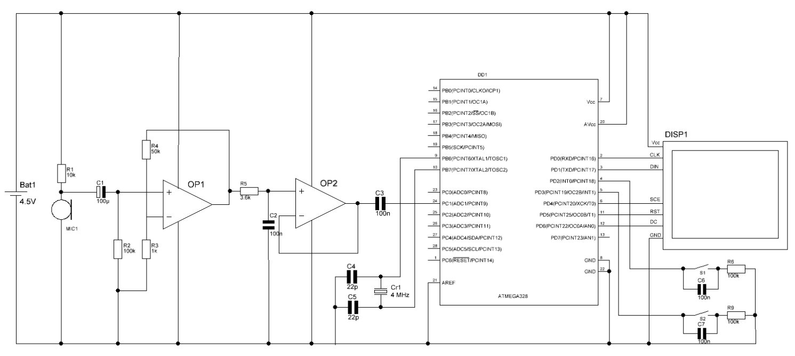

# SimpleGuitarTuner

This is a simple guitar tuner project for Atmega328.\
Tested only with SimulIDE. \
Compiled with avr-gcc.

## Circuit diagram

## Used libraries
ArduinoFFT https://github.com/kosme/arduinoFFT \
NOKIA5110 https://github.com/LittleBuster/avr-nokia5110 

